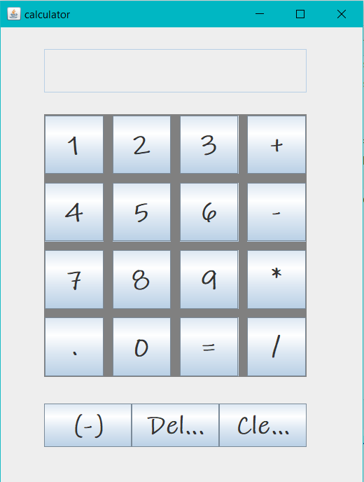

# Calculator Application

A simple and efficient calculator application developed in **Java**, capable of performing basic arithmetic operations. This project demonstrates the use of core Java concepts and provides a clean, user-friendly interface for quick calculations.

## Features
- **Basic Operations**: Addition, Subtraction, Multiplication, and Division.
- **User-Friendly Interface**: Built with **Swing/JavaFX** for an intuitive graphical interface.
- **Error Handling**: Displays appropriate messages for invalid inputs or division by zero.
- **Lightweight and Fast**: Runs efficiently with minimal resource usage.

## Technologies Used
- **Java SE**: Core programming language.
- **Swing/JavaFX**: For building the graphical user interface (GUI).

### Prerequisites
- **Java Development Kit (JDK)** version 8 or higher.
- A code editor or IDE like IntelliJ IDEA, Eclipse, or NetBeans.

## Screenshots

## How It Works
1. Enter numbers in the provided input fields.
2. Select the operation you wish to perform (Add, Subtract, Multiply, Divide).
3. Click the "Calculate" button to see the result.

## Future Enhancements
- Add support for advanced operations like square roots, exponents, and logarithms.
- Implement a history feature to keep track of previous calculations.
- Include a dark mode for improved UI experience.
- 
## License
This project is licensed under the MIT License. See the [LICENSE](LICENSE) file for more details.

## Contact
Developed by **Aditya Raj**. Feel free to reach out!

